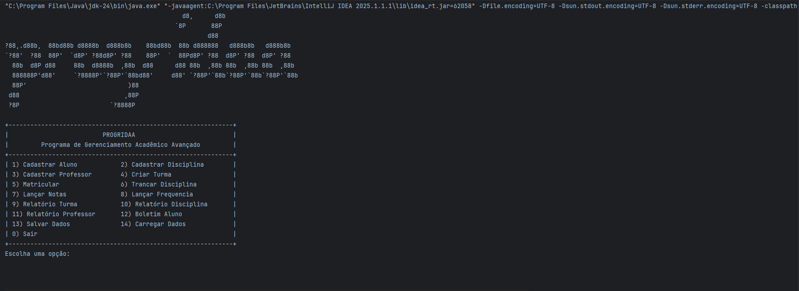
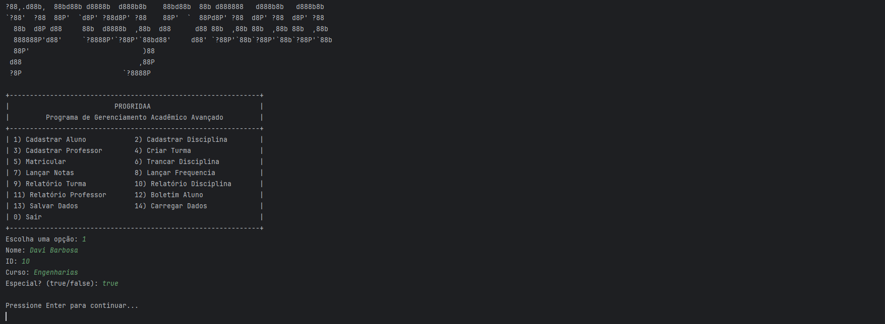
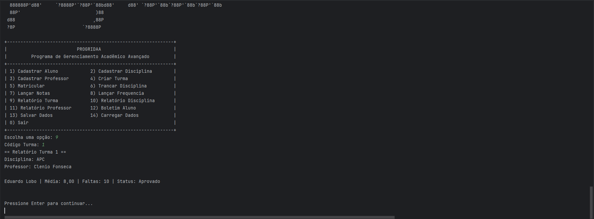
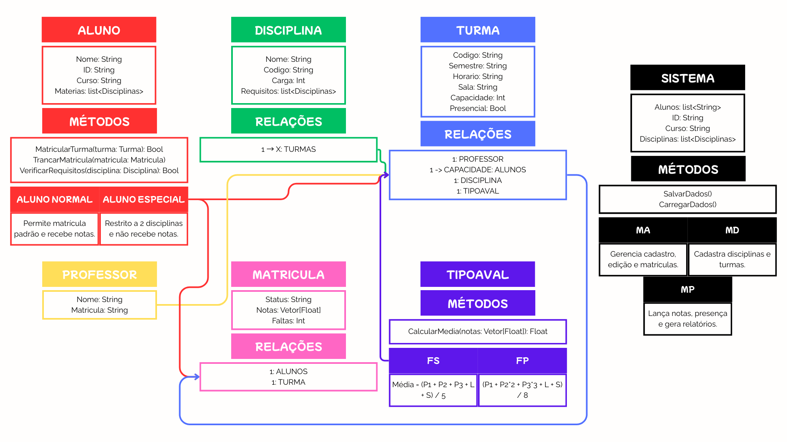

# Sistema Acadêmico - FCTE

## Descrição do Projeto

Desenvolvimento de um sistema acadêmico para gerenciar alunos, disciplinas, professores, turmas, avaliações e frequência, utilizando os conceitos de orientação a objetos (herança, polimorfismo e encapsulamento) e persistência de dados em arquivos.

O enunciado do trabalho pode ser encontrado aqui:
- [Trabalho 1 - Sistema Acadêmico](https://github.com/lboaventura25/OO-T06_2025.1_UnB_FCTE/blob/main/trabalhos/ep1/README.md)

## Dados do Aluno

- **Nome completo:** Eduardo Lôbo Moreira
- **Matrícula:** 241011027
- **Curso:** Engenharia de Software
- **Turma:** OO - T06 (2025.1 - 24M5 24T1)

---

## Instruções para Compilação e Execução

1. **Compilação:**  
— No diretório raiz do projeto:
```bash
javac -d bin src/*.java
````
Isso compila todos os arquivos em `src/` e gera as classes em `bin/`.

2. **Execução:**  
— Ainda na raiz do projeto, execute

```bash
java -cp bin Main
```

Ou:

```bash
cd bin
java Main
```

3. **Estrutura de Pastas:**  
```bash
projeto/
├── src/
│   ├── Main.java
│   ├── Sistema.java
│   ├── Aluno.java
│   ├── AlunoNormal.java
│   ├── AlunoEspecial.java
│   ├── Professor.java
│   ├── Disciplina.java
│   ├── Turma.java
│   ├── Matricula.java
│   ├── TipoAval.java
│   ├── MediaSimples.java
│   └── MediaPonderada.java
├── bin/
├── dados/
├── README.md
├── alunos.csv
├── professores.csv
├── disciplinas.csv
├── turmas.csv
├── matriculas.csv
├── diagrama.png
├── print3.png
├── print2.png
└── print1.png
```

4. **Versão do JAVA utilizada:**  
O sistema foi desenvolvido e testado com **Java 24**.
Verifique sua versão local com:

```bash
java -version
```

---

## Vídeo de Demonstração

Vídeo 1: Descrição do código

https://drive.google.com/file/d/1DdsqjUhTQO9w863ZDTccPIhhB_bO72LJ/view?usp=sharing

Vídeo 2: Execução do código

https://drive.google.com/file/d/1BFbnHOb71LiSl3DMSlFcvg_ivYPn1RHK/view?usp=sharing

---

## Prints da Execução

1. Menu Principal:  
   

2. Cadastro de Aluno:  
   

3. Relatório de Frequência/Notas:  
   

4. Diagrama de classes:  
   

---

## Principais Funcionalidades Implementadas

- [✔️] Cadastro, listagem, matrícula e trancamento de alunos (Normais e Especiais)
- [✔️] Cadastro de disciplinas e criação de turmas (presenciais e remotas)
- [✔️] Matrícula de alunos em turmas, respeitando vagas e pré-requisitos
- [✔️] Lançamento de notas e controle de presença
- [✔️] Cálculo de média final e verificação de aprovação/reprovação
- [✔️] Relatórios de desempenho acadêmico por aluno, turma e disciplina
- [✔️] Persistência de dados em arquivos (.txt ou .csv)
- [✔️] Tratamento de duplicidade de matrículas
- [✔️] Uso de herança, polimorfismo e encapsulamento

---

## Observações (Extras ou Dificuldades)

- Um dos maiores desafios deste projeto foi garantir uma persistência confiável em CSV: lidar com campos que contêm múltiplos valores (como listas de pré-requisitos e notas) exigiu dividir e remontar corretamente as strings, além de manter a ordem de carregamento das entidades para resolver todas as referências cruzadas. Outro ponto crítico foi o tamanho excessivo de Sistema.java, que cresceu demais ao concentrar toda a lógica de cadastro, relatórios, CSV e CLI em um único arquivo; isso torna a manutenção e a leitura do código mais difíceis, apontando para a necessidade de refatoração (que aconteceu já 2 vezes...) em módulos menores e mais coesos.

---

## Contato

- Eduardolobo1717@yahoo.com
